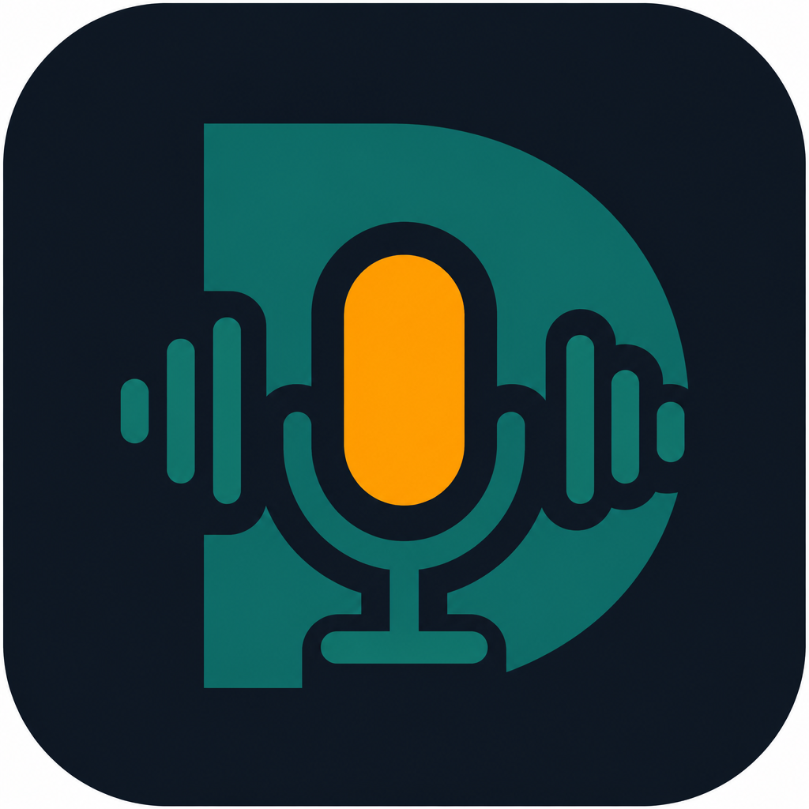

# DictateKit

<p align="center">
  
</p>

Privacy-first voice dictation for **macOS, Windows, and Linux**.

Press a hotkey, speak, and your words paste into whichever app is focused. Transcription runs locally with Whisper / NVIDIA Parakeet — your audio never has to leave your machine.

## Why DictateKit?

DictateKit is a fork of [OpenWhispr](https://github.com/OpenWhispr/openwhispr), rebranded for a **free, local-first** experience without Pro upsells in the UI.

| Goal                   | Approach                                                          |
| ---------------------- | ----------------------------------------------------------------- |
| Cross-platform         | Electron + React (not a VoiceInk Swift port)                      |
| No trial / license nag | Local dictation works without buying anything                     |
| No advertising         | Every upsell surface is removed — see [Advertising](#advertising) |
| Custom brand           | DictateKit naming, app id `com.dictatekit.app`                    |

## Advertising

There is none. Upstream OpenWhispr ships a paid cloud tier, and this fork strips
the promotion of it:

- The upgrade dialog that popped up after a dictation is **deleted**, along with
  its `limit-reached` IPC channel
- "Approaching your weekly limit" nag toasts are **removed**
- The "Try Pro free for 7 days" card and the plan-comparison grid are **gone**
- "Upgrade to Pro" / "View plans" buttons are stripped from notes upload, the
  realtime banner, and the API/MCP/CLI integration cards

`src/config/promotions.ts` holds the `PROMOTIONS_ENABLED = false` switch that
gates the few surfaces that were kept in place rather than deleted, so upstream
merges stay easy to audit.

Two things are deliberately **kept**, because removing them would hurt you:

- **Manage Billing / Manage Subscription** — anyone who already pays for
  DictateKit Cloud must be able to review or cancel from inside the app
- **The factual usage meter** for signed-in cloud accounts — stating how many
  words remain is information, not an ad

Note that this changes the _interface_, not the _server_. Word limits on
DictateKit Cloud are enforced by the remote API, so hiding a button cannot lift
one. Local transcription (Whisper / Parakeet) has never been limited, is the
default here, and never contacts a server at all.

> **Name note:** `OpenDictation` already exists as another Mac project, so this fork uses **DictateKit**.

## Features

- Global hotkey dictation into any app
- Local Whisper (whisper.cpp) and Parakeet (sherpa-onnx)
- Optional cloud / BYOK providers if you want them
- Dictionary, notes, agent cleanup prompts
- macOS, Windows, and Linux builds

## Requirements

- Node.js **24+** (see `.nvmrc`)
- Platform build tools for native helpers (Xcode CLT on macOS, etc.)

## Download (macOS)

Grab the DMG for your Mac from [Releases](https://github.com/vickhunter/dictatekit/releases):

- **Apple Silicon** (M1 and later): `DictateKit-<version>-arm64.dmg`
- **Intel**: `DictateKit-<version>.dmg` (x64)

Not sure which you have? Apple menu → About This Mac. "Apple M…" is Apple Silicon; "Intel" is Intel.

### First launch (unsigned build)

Builds are not notarized, so macOS will warn on first open:

1. Drag **DictateKit** to Applications, then right-click the app → **Open** → **Open**.
2. On macOS 15 (Sequoia) and later the right-click bypass may not appear. Try to open the
   app once, then go to **System Settings → Privacy & Security**, scroll down, and click
   **Open Anyway**.
3. If it still refuses, clear the quarantine flag from Terminal:

   ```bash
   xattr -cr /Applications/DictateKit.app
   ```

Then grant Microphone and Accessibility permissions when prompted — dictation pastes into
the focused app, which needs Accessibility.

### Cutting a release (maintainers)

Releases are built by `.github/workflows/release.yml` (macOS arm64 + x64, Windows, Linux):

```bash
# the tag must match the version in package.json
git tag "v$(node -p "require('./package.json').version")"
git push origin --tags
```

Signing is optional: without `APPLE_CERTIFICATE_BASE64` & co. the workflow produces
unsigned (ad-hoc) builds. DMGs are also attached to each run as workflow artifacts.

## Quick start (development)

```bash
git clone https://github.com/vickhunter/dictatekit.git
cd dictatekit
nvm use 24
npm install
npm run dev
```

First run compiles native helpers and may download local model runtimes (whisper.cpp, sherpa-onnx, etc.). That can take a while.

### Useful scripts

| Command               | Description                         |
| --------------------- | ----------------------------------- |
| `npm run dev`         | Dev mode (Vite renderer + Electron) |
| `npm start`           | Run packaged electron entry         |
| `npm run build:mac`   | macOS build                         |
| `npm run build:win`   | Windows build                       |
| `npm run build:linux` | Linux build                         |
| `npm test`            | Unit tests                          |
| `npm run typecheck`   | TypeScript check                    |

## Config / cache locations

After rebranding, local caches use `~/.cache/dictatekit/` (models, qdrant, etc.). Electron `userData` follows the DictateKit app id.

## Attribution

Based on **OpenWhispr** by the OpenWhispr / Gizmo Labs team — MIT licensed. See [LICENSE](LICENSE).

Upstream: https://github.com/OpenWhispr/openwhispr

## Roadmap (this fork)

1. Polish DictateKit branding (icons, colors, copy)
2. Keep local dictation as the default path with zero paywall UX
3. Optionally simplify onboarding (skip cloud account)
4. VoiceInk-inspired extras later: stronger per-app modes, dictionary UX

## License

MIT — see [LICENSE](LICENSE).
